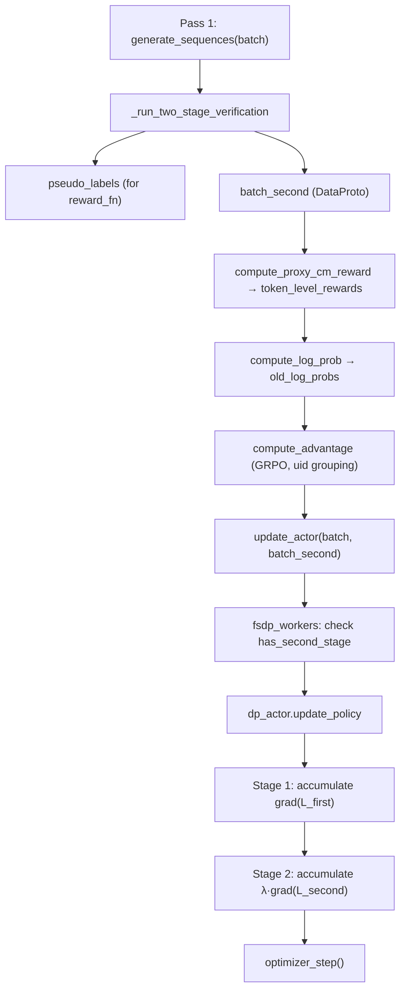

# Walkthrough: Two-Stage Joint Update Implementation

## Overview

This implementation adds **joint Generator + Verifier optimization** to the DIV-TTRL-PR training pipeline. After the existing two-stage self-verification pass, the verification rollouts are now used as second-stage training data. Both first-stage (generator) and second-stage (verifier) losses are accumulated in a single backward pass before the optimizer step.

At a code level, the current implementation follows this pattern:

$$
L_{total} \approx L_{first} + \lambda_{second} \cdot L_{second}
$$

where:
- $L_{first}$ is the standard PPO-style loss for the original rollout batch.
- $L_{second}$ is the group-normalized PPO loss for verification samples, grouped by `uid`.
- The two losses are not merged into one explicit tensor first; instead, they are accumulated through `backward()` in the same optimizer step.
- In the second stage, the current implementation uses policy loss only (`pg_loss_s`), while entropy / KL terms remain part of the first-stage PPO path.

This makes the second-stage contribution roughly comparable in scale to the first-stage update, which is why `lambda_second` can be tuned as a stable trade-off coefficient rather than a sample-count correction term.

## Current Loss Computation

### 1. First-stage loss
The first stage is the existing PPO update on `batch`.

In `dp_actor.update_policy()`, the batch is split into mini-batches / micro-batches, and each micro-batch does:
- forward pass on the generator rollout data,
- compute `pg_loss`,
- optionally add entropy regularization,
- optionally add KL penalty,
- scale by gradient accumulation or dynamic batch size,
- call `loss.backward()`.

So the first-stage objective is the normal actor loss already used by the trainer, i.e. the standard PPO-style loss over the generator samples.

### 2. Second-stage loss
The second stage is built from verification rollouts.

The verification samples are first transformed into `batch_second`, then:
- Proxy CM reward is written into `token_level_rewards`,
- `old_log_probs` are recomputed on `batch_second`,
- GRPO advantages are computed using `uid` grouping,
- the batch is sent into the actor update path as a second training stream.

Inside `dp_actor.update_policy()`, the second-stage samples are grouped by `uid`, then each group is split into micro-batches and processed independently. The current scaling rule is:

$$
loss_{second} = \frac{\lambda_{second}}{G \cdot M_g} \sum_{g=1}^{G} \sum_{j=1}^{M_g} pg\_loss_{s}^{(g,j)}
$$

where:
- $G$ is the number of verification groups in the batch,
- $M_g$ is the number of micro-batches for group $g$,
- `pg_loss_s` is the GRPO-shaped policy loss for a second-stage micro-batch.

In the current implementation, this second-stage path does **not** add extra entropy or KL terms; it is a policy-loss-only verification update.

### 3. Final update
The first-stage gradient and the second-stage gradient are accumulated in the same `optimizer.zero_grad()` window.

After both paths finish their `loss.backward()` calls, the trainer executes one final optimizer step. In other words, the implementation behaves like:

$$
\nabla L_{total} = \nabla L_{first} + \lambda_{second} \nabla L_{second}
$$

with a single `optimizer.step()` at the end.

## Files Changed

### 1. [two_stage_utils.py](file:///d:/Repository/GitHub/group/DIV-TTRL-PR/verl/verl/utils/reward_score/ttrl/two_stage_utils.py)

**Added**: `compute_proxy_cm_reward()` function (lines 442-533)

- Computes Proxy Confusion Matrix rewards for verification samples
- Reward schema: TP/TN → positive reward × consistency, FP → negative reward × consistency, FN → −0.5 × consistency, format failure → −1.0
- Accepts `is_accepted_flags` and `consistency_scores` as `Dict[int, bool/float]` keyed by `prompt_group_idx` (not list index) to handle sparse subsets correctly
- Returns `(rewards_list, cm_metrics_dict)` for logging

---

### 2. [ray_trainer.py](file:///d:/Repository/GitHub/group/DIV-TTRL-PR/verl/verl/trainer/ppo/ray_trainer.py)

**Modified**: `_run_two_stage_verification()` (lines 995-1222)

- **Return type changed**: Now returns `(final_pseudo_labels, batch_second, verify_outputs, verify_mapping, groups_to_verify)` tuple
- **Chunk outputs preserved**: Instead of deleting `chunk_output` after decoding, it's moved to CPU and collected in `all_chunk_outputs`
- **batch_second assembly**: Uses `DataProto.concat(all_chunk_outputs)` directly — the output from `generate_sequences` already contains the complete DataProto (prompt+response). ~~The initial implementation incorrectly tried to union with verification_batch which would crash on overlapping `input_ids`~~
- **uid assignment**: Each verification sample gets a `verify_group_{idx}` uid for GRPO grouping

**Modified**: `fit()` — Second-stage processing block (lines 1321-1420)

- After verification, computes Proxy CM rewards via `compute_proxy_cm_reward()` with proper dict-based alignment
- Injects `token_level_rewards` into `batch_second` at the last valid token position
- Computes `old_log_probs` for `batch_second` via `compute_log_prob`
- Computes GRPO advantages for `batch_second` using uid-based grouping

**Modified**: `fit()` — update_actor call (lines 1640-1660)

- Always passes **two DataProto args** (required by `DP_COMPUTE_PROTO` dispatch)
- When `batch_second` is available → sets `has_second_stage=True` in meta_info
- When `batch_second` is None → passes a minimal `batch[:1]` dummy with `has_second_stage=False`

**Modified**: `fit()` — GC cleanup (line 1693)

- Added `batch_second` to the explicit cleanup section

---

### 3. [fsdp_workers.py](file:///d:/Repository/GitHub/group/DIV-TTRL-PR/verl/verl/workers/fsdp_workers.py)

**Modified**: `update_actor()` (lines 499-553)

- Signature: `update_actor(self, data: DataProto, data_second: DataProto)` — both required
- Checks `data_second.meta_info["has_second_stage"]` to determine if joint training is active
- If False, sets `data_second = None` (discards dummy)
- If True, moves to GPU and preprocesses through ulysses sharding manager
- Passes `data_second` through to `update_policy`

---

### 4. [dp_actor.py](file:///d:/Repository/GitHub/group/DIV-TTRL-PR/verl/verl/workers/actor/dp_actor.py)

**Modified**: `update_policy()` (lines 276-520)

- Signature: `update_policy(self, data: DataProto, data_second: DataProto = None)`
- **First stage** (lines 342-437): Standard PPO gradient accumulation (unchanged logic, renamed variables to avoid shadowing)
- **Second stage** (lines 439-513): New group-level gradient accumulation:
  1. Groups verification samples by `uid` 
  2. For each group `g` of size `n_g`: splits into micro-batches, computes PPO loss
  3. Current scaling rule: `loss_s = (pg_loss_s * lambda_second) / (num_groups * num_group_micro_batches)`
  4. This approximates: `L_second = (1/G) · Σ_g( (1/n_g) · Σ_j(l_second^{g,j}) )` and then combines it with the first-stage gradient in a single backward pass
- **Single optimizer step** at line 515 — after both first and second stage gradients are accumulated
- `lambda_second` defaults to 0.5, configurable via `config.lambda_second`

## Critical Bugs Found & Fixed

| Bug | Impact | Fix |
|---|---|---|
| `batch_second` assembled via `union()` | Would crash — overlapping `input_ids` | Use `DataProto.concat()` directly on gen outputs |
| `update_actor(batch)` single-arg | `DP_COMPUTE_PROTO` asserts all args are DataProto | Always pass 2 args; use dummy + meta_info flag |
| `is_accepted_flags` as list | Wrong group lookup on non-contiguous indices | Changed to `Dict[int, bool]` keyed by `prompt_group_idx` |

## Data Flow

## Verification

- **Static analysis**: All code paths verified for type correctness, import availability, and DataProto API compatibility
- **Dispatch layer**: Confirmed `DP_COMPUTE_PROTO` requires all positional args to be DataProto; handled with dummy + flag pattern
- **Backward compatibility**: When `two_stage_verify=False`, the code path is identical to before (dummy second arg is discarded immediately in fsdp_workers)
