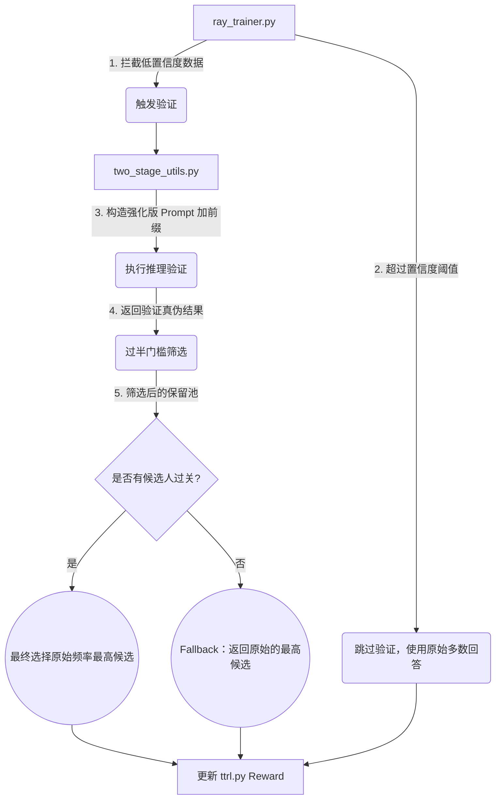

# 两阶段自验证算法优化实现报告

我已经根据咱们定下的计划，完成了代码链路的全面更新。现在系统能够智能地在低频自信（Majority < 0.3）时启动独立的多票逆向验证，并在保留集合中选择最佳备选答案。

## 变更文件概览

## 变更详情

### 1. `two_stage_utils.py` (底层工具类)

> [!CAUTION]
> **注入引导标签：** 现调用验证引擎时，我们会在 `prompt_text` 末尾主动追加 `<reverse_verification>\n` 以防止模型乱输出格式外内容，提高解析成功率。这是一处高收益的代码调整。

*   **更新验证 Prompt:** 严格采用了您的 `Rigorous Reviewer` 原则和逆向推导的命令模板。
*   **计算 Majority 指标：** 在 `extract_candidate_answers` 提取回答后，直接利用 `n_votes_per_prompt` 预先算好 `majority_rate` 并原样携带原始多数答案 (`majority_answer`) 作为后续判断的元数据。
*   **新解析器:** 使用稳定的字符包含法(`verification result: true`)替代了容易失效的正则表达式提取模式。
*   **重构票数筛选 (`resolve_filtered_pseudo_labels`):**
    *   移除旧的贪婪和抽样模式。
    *   对每个 Top-5 答案统计并判定 `true_count > false_count`。
    *   在保留集中选回落 (基于频率排序)，如果全军覆没则直接回落到原答案 (`original_majority_ans`)。

### 2. `ray_trainer.py` (PPO 控制层)

> [!TIP]
> **新增强化学习指标：** 修改后你可以在 wandb / swanlab 面板看到三个新的监控曲线：
> - `train/two_stage_trigger_rate` (本批次多少题目触发了二阶段验证)
> - `train/two_stage_filtered_ratio` (触发验证的题目里，过滤机制成功保留出新答案的占比)
> - `train/two_stage_majority_rate_mean` (本批次的平均首选率)

*   **智能拦截 (`_run_two_stage_verification`):**
    *   调用 `two_stage_utils` 的工具并写死了 `max_candidates=5`。
    *   剥离 `majority_rate < 0.3` 的数据集构建专属验证请求 `groups_to_verify`，对不满足的直接退回跳过。
*   **合并判定结果:** 将经过多数票洗礼的答案合并回整个 Batch 流，并将指标发送记录，无需改动底层的 `TTRLRewardManager`。

## 检验预期

下次执行训练时，建议您检查驱动控制台的前几步输出：

1. 如果多数频次很高，应该会打印： `[TwoStage] All prompt groups skipped verification due to majority >= 0.3`。
2. 触发时将清楚显示： `[TwoStage] Triggered verification for 3/10 prompt groups`。
3. 验证完会有： `[TwoStage] Successfully filtered to new candidate in 2/3 triggered groups`。
