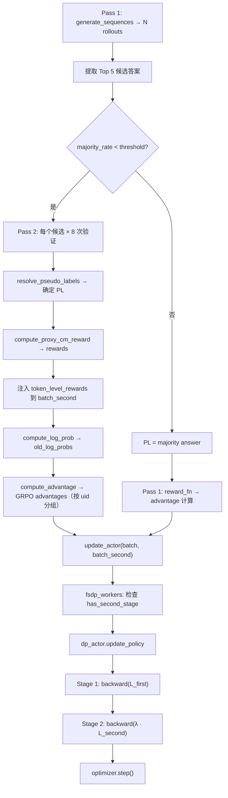

# 实施计划：Generator + Verifier 联合更新（V3）

本计划综合 `update_both.md`（设计理念）与 `update_both_changed.md`（实现经验），为第二阶段验证 rollouts 引入强化学习训练信号。核心思路是：**完全解耦采样频率与 Loss 计算**，两阶段分别计算梯度并在同一个 `optimizer.step()` 中累加。

---

## 一、核心设计决策

### 1.1 验证参数（脚本层配置，无需硬编码）

| 参数 | 值 | 说明 |
|---|---|---|
| `two_stage_max_candidates` | 5 | 从第一阶段按频率取 Top K 候选 |
| `two_stage_n` | 8 | 每个候选验证 N 次（采样模式） |
| `two_stage_mode` | sampling | 采样模式，temperature 由脚本控制 |
| 总验证量/prompt | ≤ 40 | 5 × 8 = 40 条验证 rollout |

### 1.2 伪标签选择逻辑（已由现有代码实现，只需设置参数）

- 统计每个候选的 True 票数 → 选 True 最多的
- 平票时 → 回退到第一阶段出现频率最高的候选
- 全 0 票 True → 回退到第一阶段 majority answer

### 1.3 奖励公式（代理混淆矩阵）

给定最终伪标签 $PL$ 及其一致性 $c = Count(PL) / N_{samples}$：

| Proxy 状态 | 条件 | 奖励 |
|---|---|---|
| **TP** | $C_i == PL$ 且模型判 True | $+1.0 \times c$ |
| **TN** | $C_i \neq PL$ 且模型判 False | $+1.0 \times c$ |
| **FP** | $C_i \neq PL$ 且模型判 True | $-1.0 \times c$ |
| **FN** | $C_i == PL$ 且模型判 False | $-0.5 \times c$ |
| **格式错误** | 缺少 `<reverse_verification>` 或 `Verification Result` | $-1.0$（固定） |

### 1.4 联合更新数学形式

$$
\mathcal{L}_{second}^{(g)} = \frac{1}{n_g} \sum_{j=1}^{n_g} \ell_{second}^{(g,j)}, \qquad
\mathcal{L}_{second} = \frac{1}{G} \sum_{g=1}^{G} \mathcal{L}_{second}^{(g)}
$$
$$
\nabla \mathcal{L}_{total} = \nabla \mathcal{L}_{first} + \lambda \nabla \mathcal{L}_{second}
$$

其中：
- $G$ = batch 内的验证组数（每个 (prompt, candidate) 为一组）
- $n_g$ = 第 $g$ 组内的验证样本数（通常为 8）
- $\lambda$ = `lambda_second`，默认 **0.5**
- 两阶段梯度在同一个 `optimizer.zero_grad()` 窗口内通过两次 `backward()` 累加

> [!IMPORTANT]
> **为什么不用 DataProto.concat 拼接？**
> 
> `update_both_changed.md` 的实现经验表明，拼接方案有三个严重问题：
> 1. 两阶段的序列长度不同，需要大量 padding 浪费显存
> 2. 拼接后的 batch_size 可能无法被 `ppo_mini_batch_size` 整除
> 3. 两阶段样本混在同一 mini-batch 中，loss 尺度难以控制
>
> 因此采用 **双 DataProto 方案**：传递两个独立的 DataProto 给 `update_actor`，在 `dp_actor.update_policy` 内部分别计算梯度。

---

## 二、拟进行的更改

### 2.1 [two_stage_utils.py](file:///d:/学习/科研/DIV-TTRL-PR/verl/verl/utils/reward_score/ttrl/two_stage_utils.py)

#### [修改] `resolve_filtered_pseudo_labels`
- 额外返回每个 prompt group 的 PL consistency（`Count(PL) / n_votes_per_prompt`）。
- 返回类型从 `List[Optional[str]]` 改为 `Tuple[List[Optional[str]], List[float]]`。

#### [新增] `compute_proxy_cm_reward`
```python
def compute_proxy_cm_reward(
    verification_outputs: List[str],
    verification_mapping: List[Dict],
    is_accepted_flags: Dict[int, bool],     # {prompt_group_idx: C_i == PL}
    consistency_scores: Dict[int, float],   # {prompt_group_idx: consistency}
) -> Tuple[List[float], Dict[str, float]]:
    """基于代理混淆矩阵计算验证 rollout 的奖励。
    
    Returns:
        rewards: 每个验证样本的标量奖励
        cm_metrics: {"tp_rate": ..., "tn_rate": ..., "fp_rate": ..., ...}
    """
```

> [!IMPORTANT]
> **参数使用 Dict 而非 List**：`is_accepted_flags` 和 `consistency_scores` 按 `prompt_group_idx` 索引，而非按列表位置索引。这是因为并非所有 prompt group 都会触发验证，直接用列表下标会导致错误映射（参考 `update_both_changed.md` 的 bug fix）。

---

### 2.2 [ray_trainer.py](file:///d:/学习/科研/DIV-TTRL-PR/verl/verl/trainer/ppo/ray_trainer.py)

#### [修改] `_run_two_stage_verification`

**返回类型变更**：
```python
# 旧：
def _run_two_stage_verification(...) -> List[Optional[str]]

# 新：
def _run_two_stage_verification(...) -> Tuple[
    List[Optional[str]],       # pseudo_labels
    Optional[DataProto],       # batch_second (可训练的验证 DataProto)
    List[str],                 # verification_outputs (decoded texts)
    List[Dict],                # verification_mapping
    List[Dict],                # groups_to_verify (触发验证的 prompt groups)
]
```

**关键变更**：
1. **保留 chunk_output**：不再在解码后删除 `generate_sequences` 的输出，而是 `.to("cpu")` 后收集到 `all_chunk_outputs` 列表。
2. **组装 batch_second**：使用 `DataProto.concat(all_chunk_outputs)` 直接拼接生成输出（已包含 prompt + response 的完整 DataProto）。
3. **分配 uid**：为每个验证样本分配 `verify_group_{prompt_idx}_{candidate}` 格式的 UID，同一 (prompt, candidate) 的 8 个采样共享 UID。

#### [修改] `fit` 训练循环 — 第二阶段处理

在 `_run_two_stage_verification` 返回后，新增以下处理逻辑：

```python
pseudo_labels, batch_second, verify_outputs, verify_mapping, groups_to_verify = \
    self._run_two_stage_verification(batch, metrics)

# ... 正常的第一阶段 reward / advantage 计算 ...

if batch_second is not None and len(batch_second) > 0:
    # Step 1: 计算 Proxy CM 奖励
    is_accepted_flags = {g["prompt_group_idx"]: (g["majority_answer"] == pseudo_labels[g["prompt_group_idx"]])
                         for g in groups_to_verify}
    consistency_scores = {g["prompt_group_idx"]: pl_consistencies[g["prompt_group_idx"]]
                          for g in groups_to_verify}
    rewards, cm_metrics = compute_proxy_cm_reward(
        verify_outputs, verify_mapping, is_accepted_flags, consistency_scores)
    
    # Step 2: 注入 token_level_rewards（放在最后一个有效 token 位置）
    response_length = batch_second.batch["responses"].shape[-1]
    token_level_rewards = torch.zeros(len(batch_second), response_length)
    prompt_length = batch_second.batch["prompts"].shape[-1]
    for i in range(len(batch_second)):
        valid_resp_len = int(batch_second.batch["attention_mask"][i, prompt_length:].sum().item())
        if valid_resp_len > 0:
            token_level_rewards[i, valid_resp_len - 1] = rewards[i]
    batch_second.batch["token_level_rewards"] = token_level_rewards
    
    # Step 3: 计算 old_log_probs
    old_log_prob_output = self.actor_rollout_wg.compute_log_prob(batch_second)
    batch_second.batch["old_log_probs"] = old_log_prob_output.batch["old_log_probs"]
    
    # Step 4: 计算 GRPO advantages（按 uid 分组）
    batch_second = compute_advantage(batch_second, adv_estimator="grpo", ...)
    
    # Step 5: 记录 metrics
    metrics.update({"train/" + k: v for k, v in cm_metrics.items()})
```

#### [修改] `fit` 训练循环 — update_actor 调用

```python
# DP_COMPUTE_PROTO 要求所有位置参数都是 DataProto
# 当没有第二阶段数据时，传一个 dummy DataProto + has_second_stage=False
if batch_second is not None and len(batch_second) > 0:
    batch_second.meta_info["has_second_stage"] = True
    actor_output = self.actor_rollout_wg.update_actor(batch, batch_second)
else:
    dummy_second = batch[:1]  # 取第一个样本做 dummy
    dummy_second.meta_info["has_second_stage"] = False
    actor_output = self.actor_rollout_wg.update_actor(batch, dummy_second)
```

> [!WARNING]
> **内存管理**：在 `batch_second` 用完后，显式 `del batch_second` 并调用 `gc.collect()` + `torch.cuda.empty_cache()`。

---

### 2.3 [fsdp_workers.py](file:///d:/学习/科研/DIV-TTRL-PR/verl/verl/workers/fsdp_workers.py)

#### [修改] `update_actor` 签名

```python
@register(dispatch_mode=Dispatch.DP_COMPUTE_PROTO)
def update_actor(self, data: DataProto, data_second: DataProto):
    data = data.to(torch.cuda.current_device())
    
    # 检查第二阶段是否有效
    has_second_stage = data_second.meta_info.get("has_second_stage", False)
    if has_second_stage:
        data_second = data_second.to(torch.cuda.current_device())
    else:
        data_second = None
    
    # ... 原有的 offload / sharding 逻辑 ...
    
    with self.ulysses_sharding_manager:
        data = self.ulysses_sharding_manager.preprocess_data(data)
        if data_second is not None:
            data_second = self.ulysses_sharding_manager.preprocess_data(data_second)
        
        metrics = self.actor.update_policy(data=data, data_second=data_second)
    
    # ... 原有的 metrics / lr_scheduler 逻辑 ...
```

---

### 2.4 [dp_actor.py](file:///d:/学习/科研/DIV-TTRL-PR/verl/verl/workers/actor/dp_actor.py)

#### [修改] `update_policy` — 核心变更

```python
def update_policy(self, data: DataProto, data_second: DataProto = None):
    self.actor_module.train()
    temperature = data.meta_info["temperature"]
    lambda_second = self.config.get("lambda_second", 0.5)
    
    # === 第一阶段 dataloader（不变） ===
    select_keys = ["responses", "input_ids", "attention_mask", "position_ids", 
                   "old_log_probs", "advantages"]
    if self.config.use_kl_loss:
        select_keys.append("ref_log_prob")
    batch = data.select(batch_keys=select_keys).batch
    dataloader = batch.split(self.config.ppo_mini_batch_size)
    
    # === 第二阶段：按 uid 分组 ===
    verification_groups = None
    if data_second is not None:
        uids = data_second.non_tensor_batch["uid"]
        unique_uids = list(set(uids))
        verification_groups = []
        for uid in unique_uids:
            mask = np.array([u == uid for u in uids])
            group_data = data_second[np.where(mask)[0].tolist()]
            group_batch = group_data.select(batch_keys=select_keys).batch
            verification_groups.append(group_batch)
    
    metrics = {}
    for epoch in range(self.config.ppo_epochs):
        for batch_idx, mini_batch in enumerate(dataloader):
            self.actor_optimizer.zero_grad()
            
            # ─── 第一阶段：正常 PPO / GRPO loss ───
            micro_batches = mini_batch.split(self.config.ppo_micro_batch_size_per_gpu)
            for mb in micro_batches:
                mb = mb.to(torch.cuda.current_device())
                entropy, log_prob, topk = self._forward_micro_batch(
                    micro_batch=mb, temperature=temperature, ...)
                pg_loss, pg_clipfrac, ppo_kl, _ = compute_policy_loss(...)
                
                policy_loss = pg_loss  # + entropy / kl 项
                loss = policy_loss / self.gradient_accumulation
                loss.backward()
            
            # ─── 第二阶段：组内均值 + 组间均值 ───
            if verification_groups is not None:
                num_groups = len(verification_groups)
                for group_batch in verification_groups:
                    group_micro_batches = group_batch.split(
                        self.config.ppo_micro_batch_size_per_gpu)
                    num_group_mbs = len(group_micro_batches)
                    for mb_s in group_micro_batches:
                        mb_s = mb_s.to(torch.cuda.current_device())
                        _, log_prob_s, _ = self._forward_micro_batch(
                            micro_batch=mb_s, temperature=temperature, ...)
                        pg_loss_s, _, _, _ = compute_policy_loss(...)
                        
                        # 组内均值 + 组间均值 + lambda 缩放
                        loss_s = (pg_loss_s * lambda_second) / (num_groups * num_group_mbs)
                        loss_s.backward()
            
            # ─── 单次 optimizer step ───
            grad_norm = self._optimizer_step()
```

> [!IMPORTANT]
> **第二阶段仅使用 policy loss**：不单独计算 entropy loss 或 KL loss（参考 `update_both_changed.md` 的设计）。这简化了实现，避免了两阶段 entropy 信号冲突。

---

### 2.5 [update_first.sh](file:///d:/学习/科研/DIV-TTRL-PR/verl/examples/labelfree/update_first.sh)

```bash
# 修改验证参数
+two_stage_n=8 \                    # 原来为 -1
+two_stage_max_candidates=5 \       # 原来为 -1
# 新增 lambda 参数
+algorithm.lambda_second=0.5 \
```

---

## 三、Metrics 日志

| Metric Key | 含义 |
|---|---|
| `train/verif_reward_mean` | 验证奖励均值 |
| `train/verif_tp_rate` | Proxy TP 占比 |
| `train/verif_tn_rate` | Proxy TN 占比 |
| `train/verif_fp_rate` | Proxy FP 占比 |
| `train/verif_fn_rate` | Proxy FN 占比 |
| `train/verif_format_error_rate` | 格式错误占比 |
| `train/verif_batch_size` | 验证 batch 大小 |
| `train/verif_consistency_mean` | 平均 consistency |
| `actor/second_stage_loss` | 第二阶段 loss 值 |

---

## 四、完整数据流



---

## 五、已知问题与注意事项

1. **`DP_COMPUTE_PROTO` 派发约束**：所有位置参数必须是 `DataProto`。无第二阶段数据时，传 `batch[:1]` dummy + `has_second_stage=False` 标记。
2. **不使用 `union()`**：`update_both_changed.md` 记录了 `union()` 会因 overlapping keys（如 `input_ids`）崩溃。`batch_second` 直接用 `DataProto.concat()` 从 `generate_sequences` 输出组装。
3. **内存管理**：验证 batch 用完后显式释放。`batch_second` 在 `fit()` 中 `del` + `gc.collect()`。
4. **梯度累加兼容性**：两阶段的梯度在同一个 `zero_grad()` 窗口内通过两次 `backward()` 自然累加，无需手动合并。

---

## 六、验证计划

### 自动化测试
1. 运行 `update_first.sh` 进行一步训练，检查无 crash
2. 验证 WandB 中出现 `train/verif_*` 和 `actor/second_stage_loss` 指标
3. 检查各状态占比之和 ≈ 1.0

### 手动验证
1. 打印 `batch_second` 的 shape 和 uid 分布，确保分组正确
2. 检查 `second_stage_loss` 的数值量级与 `pg_loss` 接近（在 $\lambda$ 缩放后）
3. 确认 `two_stage_verify=False` 时行为完全不变（向后兼容）
