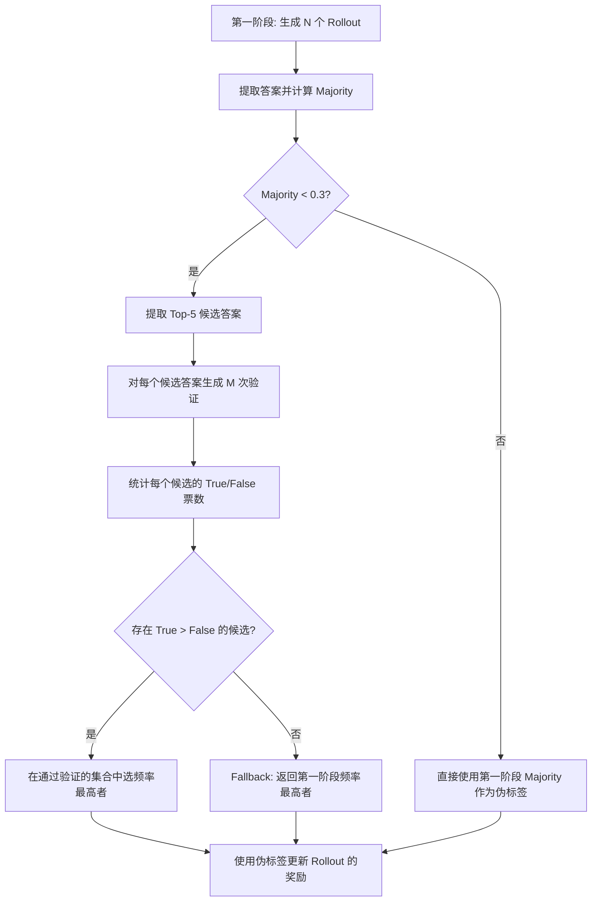

# 两阶段自验证算法优化实现计划

本计划旨在根据用户设计的算法，对现有的两阶段验证（Two-Stage Verification）框架进行针对性优化。核心目标是在第一阶段生成结果置信度较低时（Majority < 0.3），通过模型自我博弈和多数投票机制进一步筛选高置信度的伪标签。

## 已确认的设计决策

> [!IMPORTANT]
> **1. 判定阈值定义**：
> 确认 `Majority = Max(频率) / 总采样数`。仅在 `Majority < 0.3` 时触发验证流程。
>
> **2. 回退策略 (Fallback)**：
> 已确认：如果经过筛选没有任何回答通过验证（即没有候选满足 `True Votes > False Votes`），则直接返回第一阶段频率最高的原始回答作为伪标签。
>
> **3. 验证提示词样式**：
> 已采用用户提供的 Rigorous Reviewer 版本，包含引导生成前缀 `<reverse_verification>\n`。
>
> **4. 解析逻辑**：
> 参考 `verify_all_candidates_simple.py` 中的 `parse_verification_response`，使用大小写不敏感的文本包含逻辑：
> - `"verification result: true"` → `True`
> - `"verification result: false"` → `False`
> - 其他 → `None`

---

## 算法完整流程



---

## 拟议变更

### 1. 工具类核心逻辑重构

#### [MODIFY] [two_stage_utils.py](file:///d:/%E5%AD%A6%E4%B9%A0/%E7%A7%91%E7%A0%94/DIV-TTRL-PR/verl/verl/utils/reward_score/ttrl/two_stage_utils.py)

**变更 1: 替换 Prompt 模板**

将现有的冗长模板替换为用户提供的精简版：

```python
VERIFICATION_SYSTEM_PROMPT = """You are a rigorous mathematical reviewer."""

VERIFICATION_USER_TEMPLATE = """Problem:
{problem}

[Hypothesis to Test]
A previous attempt at this problem resulted in the following answer:
{candidate_answer}

[Task]
Act as a rigorous mathematical reviewer. 
Treat the previous answer ({candidate_answer}) as a given hypothesis. Plug this answer BACK into the original problem conditions. Perform a rigorous backward-substitution to check if it satisfies all constraints or if it leads to a mathematical contradiction. 

You MUST strictly use the following XML format for your response:
<reverse_verification>
(Your step-by-step backward substitution checking if {candidate_answer} contradicts the problem conditions)
Verification Result: [True/False]
</reverse_verification>"""
```

**变更 2: 引导生成前缀（Prefill）**

参考 `verify_all_candidates_simple.py` 第 314 行，在 tokenize 之后追加 `<reverse_verification>\n` 作为生成前缀，引导模型直接输出内容（而不是重新生成标签）。

> [!WARNING]
> 当前的 `construct_verification_dataproto` 没有追加引导前缀。这是一个关键差异——参考脚本通过 `prompt_text += "<reverse_verification>\n"` 使模型跳过开头标签直接产出内容，大幅提高格式遵循率。**必须在新实现中增加此前缀。**

**变更 3: 替换解析器**

将现有的基于正则表达式的 `parse_verification_result` 替换为更鲁棒的文本包含逻辑（参考 `verify_all_candidates_simple.py` 第 95-101 行）：

```python
def parse_verification_result(text: str) -> Optional[bool]:
    lower_text = text.lower()
    if "verification result: true" in lower_text or "verification result:true" in lower_text:
        return True
    elif "verification result: false" in lower_text or "verification result:false" in lower_text:
        return False
    return None
```

**变更 4: 新增过滤式解析函数**

新增 `resolve_filtered_pseudo_labels` 函数，实现核心筛选算法：

1. 按候选答案分组统计 `True` / `False` 投票数。
2. 筛选出满足 `True_votes > False_votes` 的候选人（即"保留集"）。
3. 如果保留集不为空：在其中选出第一阶段原始频率最高的答案。
4. 如果保留集为空：**直接返回第一阶段频率最高的原始回答**。

**变更 5: 新增 `extract_candidate_answers` 返回值**

在返回的 `prompt_groups` 字典中增加以下字段：
- `"majority_rate"`: `float`，该 Prompt Group 的 Majority 比例（用于触发判断）
- `"majority_answer"`: `str`，第一阶段频率最高的答案（用于 Fallback）

---

### 2. 训练控制器改造

#### [MODIFY] [ray_trainer.py](file:///d:/%E5%AD%A6%E4%B9%A0/%E7%A7%91%E7%A0%94/DIV-TTRL-PR/verl/verl/trainer/ppo/ray_trainer.py)

**变更 1: 修改 `_run_two_stage_verification` 方法**

- **触发器实现**：在提取候选答案后，逐 Prompt Group 检查 `majority_rate`。
  - 如果 `majority_rate >= 0.3`：该 Prompt 使用第一阶段 Majority 作为伪标签，跳过验证。
  - 如果 `majority_rate < 0.3`：该 Prompt 进入验证阶段。
- **参数控制**：固定 `max_candidates = 5`（Top-K = 5）。
- **Fallback 处理**：对 `resolve_filtered_pseudo_labels` 返回的结果，不再需要 `penalize` 模式——直接使用它返回的答案（已包含 Fallback 逻辑）。

**变更 2: 验证监控指标扩展**

增加以下可观测指标（记录到  wandb/swanlab）：
- `train/two_stage_trigger_rate`：本 batch 中有多少比例的 Prompt 触发了验证
- `train/two_stage_filtered_ratio`：在触发验证的 Prompt 中，有多少比例成功筛选到了通过验证的答案（vs Fallback）
- `train/two_stage_majority_rate_mean`：所有 Prompt 的平均 Majority Rate

---

### 3. Reward Manager 适配

#### [MODIFY] [ttrl.py](file:///d:/%E5%AD%A6%E4%B9%A0/%E7%A7%91%E7%A0%94/DIV-TTRL-PR/verl/verl/workers/reward_manager/ttrl.py)

**无需改动**。

现有的 `_compute_ttrl_reward` 已经在第 295-298 行正确处理了 `verified_pseudo_label`：
- 如果值非 None，直接采用该答案作为伪标签。
- 由于我们的新算法 Fallback 永远返回一个有效答案（而非 None），`two_stage_penalize` 分支将不会被触发。

---

### 4. 底层推理引擎适配

#### [MODIFY] [fsdp_workers.py](file:///d:/%E5%AD%A6%E4%B9%A0/%E7%A7%91%E7%A0%94/DIV-TTRL-PR/verl/verl/workers/fsdp_workers.py)

**无需改动**。

现有的第 575-589 行已经正确处理了 `verification_mode`：
- 检测到 `verification_mode` 后，使用 `update_sampling_params` 覆盖 `max_tokens` 和 `temperature`。
- 与新算法完全兼容。

---

## 验证计划

### 自动化测试
- **场景 A (触发)**：构造 `majority_rate = 0.15` 的数据，检查是否启动验证流程。
- **场景 B (跳过)**：构造 `majority_rate = 0.8` 的数据，检查是否跳过验证，直接使用第一阶段 Majority。
- **场景 C (过半筛选)**：构造验证结果 `{answerA: [T,T,F,T], answerB: [F,F,T,F]}`，确认只有 A 被保留。
- **场景 D (Fallback)**：构造所有候选验证均为 False，确认返回第一阶段频率最高的答案（而不是 None）。

### 手动验证
- 检查训练日志中的 `[TwoStage] Triggered: X/Y prompts` 字样。
- 观察 Wandb/SwanLab 曲线中 `train/two_stage_trigger_rate` 和 `train/two_stage_filtered_ratio` 是否符合逻辑。
- 确认当 `majority_rate >= 0.3` 时日志出现 `[TwoStage] Skipped` 而非 `Triggered`。

